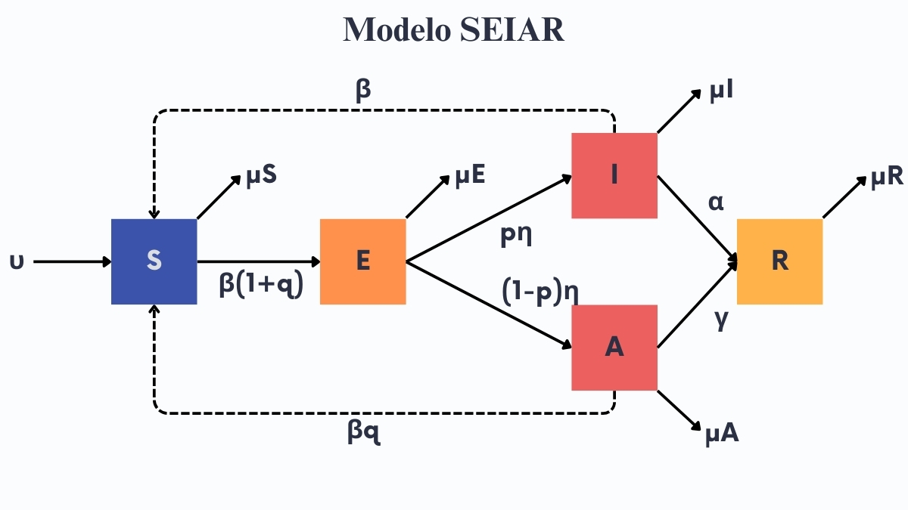
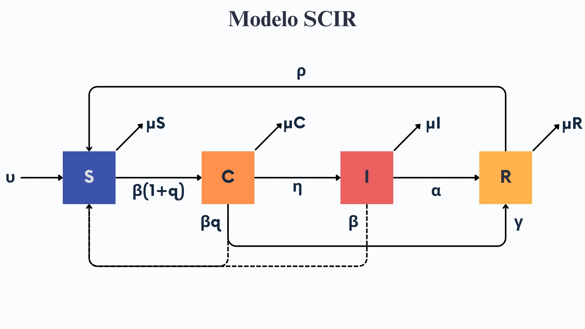
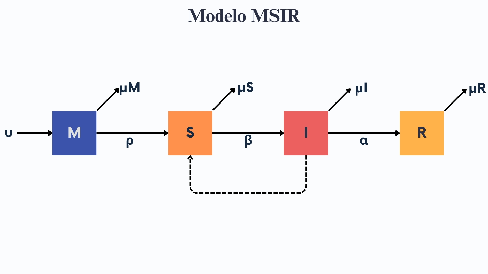
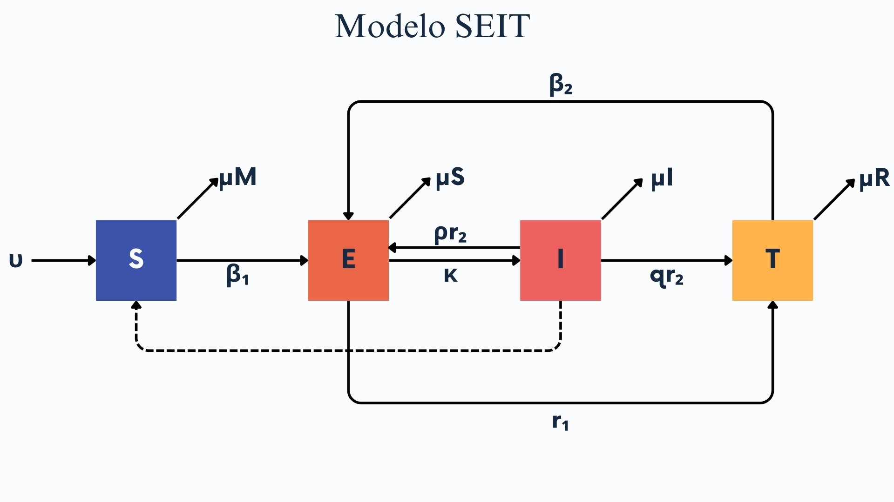
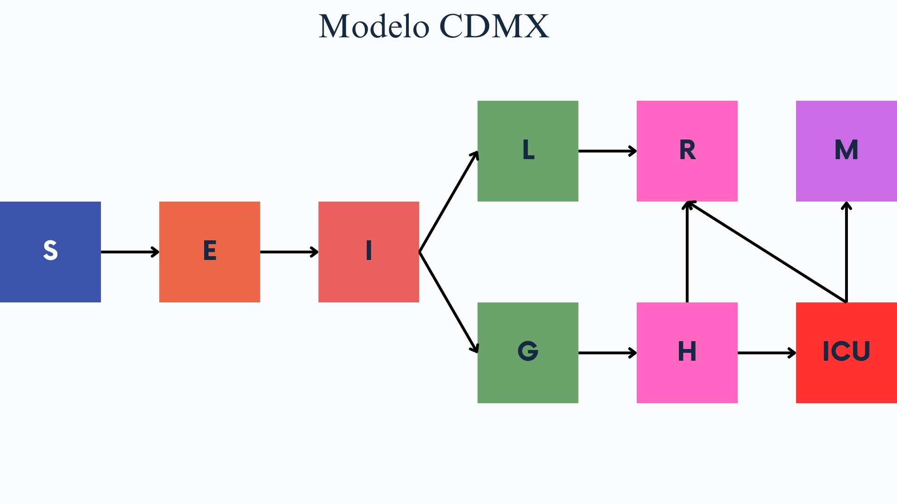

```{=html}
<style type="text/css">
  body{
    font-family: Times New Roman;
  font-size: 12pt;

}
</style>
<div style="fig-align:center;">
<div style="text-align: justify">
```
```{r setup, include=FALSE}
knitr::opts_chunk$set(echo = TRUE)

```

**PROBLEMA 2. ESTADIO ASINTOMÁTICO**

Las siguientes ecuaciones describen un modelo por compartimentos de una enfermedad infecciosa con un estadio asintomático.

$$\dot S = \nu -\beta S(I +qA)-\mu S$$
$$\dot E= \beta S(I+qA) -(\eta+\mu)E $$
$$\dot I = p\eta E -(\alpha +\mu)I$$
$$\dot A= (1-p)\eta E -(\gamma +\mu)A$$
1.  Dibuja el esquema por compartimentos que representa este conjunto de 
ecuaciones.




2.  Explica el significado de cada ecuación: es decir, explica el
    significado de cada término y cada parámetro. ¿Existen parámetros
    que están acotados, si es así indica el intervalo en donde pueden
    variar?

-   $S$: Susceptibles

-   $E$: Expuestos (Latentes)

-   $I$: Infectados

-   $A$: Asintomáticos

-   $R$: Recuperados

-   $\nu$: Tasa de nacimiento

-   $\beta$: Tasa de transmisión

-   $\mu$: Tasa de muerte

-   $\eta$: Tasa en la que un individuo en estado de latencia pasa a infectado o 
asintomático, es un valor que depende de $p$.

-   $q$: Tasa en la que un asintomático contagia a un susceptible.

-   $\gamma$: Tasa en la que un asintomático pasa a recuperado.

-   $p$: Probabilidad en la que se desarrollen los síntomas de la enfermedad. 
Es un valor acotado, porque es probabilidad y solo tiene valores de 0 a 1.

-   $\alpha$: Tasa en la que un infectado pasa a recuperado.

3.  ¿Bajo qué condiciones la población se conservaría?

La población se conserva cuando la suma de las tasas de muerte de cada grupo 
($\mu S$ + $\mu E$ + $\mu I$ + $\mu A$ + $\mu R$) es igual a $\nu$.

4.  Encuentra, si existe, el punto de equilibrio *free-disease*\

Free-disease quiere decir que toda la población es susceptible por lo que tenemos 
un P.E. (?, 0, 0, 0, 0)
Como toda la población está contenida en S, nos enfocamos unicamente en la 
ecuación de S
$$\dot S = \nu -\beta S((0) +q(0)-\mu S$$
$$\dot S = \nu- \mu S$$
Igualamos a 0

$$\nu- \mu S = 0$$
$$S = \frac{\nu}{\mu} $$
P.E. Free-Disease:
$$(\frac{\nu}{\mu}, 0, 0, 0, 0)$$

5.  ¿Qué tipo de enfermedad puede estar describiendo? Justifica tu
    respuesta.

Lo clásico sería pensar en SARS-CoV-2 (o la mayoría de sus variantes), lo cual se ajusta bastante bien al modelo
Otra enfermedad podría ser la poliomielitis, cerca del 70% de los casos son asintomáticos, pero estos casos juegan un
papel importante a la hora de contrastar la dinámica infecciosa.

6.  Selecciona un conjunto de parámetros adecuados y resuelve
    numéricamente el sistema de ecuaciones diferenciales. Asegurate que
    tu solución alcance un punto de equilibrio. Discute tu resultado.

```{r}
# Instalar librerías necesarias

library (deSolve)

library (dplyr)

library(nleqslv)

# Definir los parámetros del sistema
beta <- 0.8  # Tasa de transmisión
q <- 0.9     # Proporción de la transmisibilidad de asintomáticos
eta <- 0.4   # Tasa de progresión de expuestos a infecciosos
p <- 0.6     # Proporción de los expuestos que se convierten en infectados sintomáticos
alpha <- 0.1 # Tasa de recuperación de infectados sintomáticos
gamma <- 0.1 # Tasa de recuperación de asintomáticos
mu <- 0.05   # Tasa de mortalidad natural
nu <- 0.08   # Tasa de natalidad

# Función que representa el sistema en equilibrio (es decir, con las derivadas igual a 0)
seiar_equilibrio <- function(x) {
  S <- x[1]  # Susceptibles
  E <- x[2]  # Expuestos
  I <- x[3]  # Infectados sintomáticos
  A <- x[4]  # Asintomáticos
  R <- x[5]  # Recuperados
  
  # Ecuaciones en equilibrio (dS/dt = dE/dt = dI/dt = dA/dt = dR/dt = 0)
  eq1 <- nu - beta * S * (I + q * A) - mu * S              # dS/dt = 0
  eq2 <- beta * S * (I + q * A) - (eta + mu) * E            # dE/dt = 0
  eq3 <- p * eta * E - (alpha + mu) * I                     # dI/dt = 0
  eq4 <- (1 - p) * eta * E - (gamma + mu) * A               # dA/dt = 0
  eq5 <- alpha * I + gamma * A - mu * R                     # dR/dt = 0
  
  return(c(eq1, eq2, eq3, eq4, eq5))
}

# Valores iniciales para S, E, I, A, R
initial_values <- c(S = 980, E = 10, I = 5, A = 5, R = 0)

# Resolver el sistema no lineal usando nleqslv
result <- nleqslv(initial_values, seiar_equilibrio)

# Ver los resultados del punto de equilibrio
result$x  # Valores de S, E, I, A, R en el punto de equilibrio

# Si modelamos el Free-disease (que solo haya población en S), el P.E solo nos dará valores para S
# Si cambiamos los parámetros (añadiendo E, I, A) obtenemos valores numéricos para cada sector, este valor viene en %
# Lo que yo obtuve con estos parámetros:    S         E         I         A         R 
#                                       0.2197266 0.1533637 0.2453819 0.1635880 0.8179398 
```

```{r}
# Definir ecuaciones
SEIAR <- function(time, state, parameters) {
  with(as.list(c(state, parameters)), {

    dS <- nu - beta* S*(I+q*A) - mu*S
    dE <- beta* S*(I+q*A) - (eta + mu)*E
    dI <- p* eta *E -(alfa*mu)*I
    dA <- (1-p)*eta*E - (gama + mu)*A
    dR <- alfa* I + gama*A - mu*R

    list(c(dS, dE, dI, dA, dR))
  })
}
# Definir parámetros
params <- c(nu = 5, beta = 0.02, q = 0.9, mu = 0.01, eta = 0.5, p = 0.7, alfa = 7, gama = 1.7)
# Definir condiciones iniciales
condiciones_iniciales <- c(S = 950, E = 25, I = 20, A = 5, R = 0)
tiempo <- seq(0, 20, by = 0.1)
out <- ode(condiciones_iniciales, tiempo, SEIAR, params) 

# Correr todo esto junto
# Gráfica
matplot(out[ , 1], out[ , 2:5], type = "l", xlab = "Tiempo", ylab = "Población",
        main = "Modelo SEIAR", lwd = 2)
legend("topright", c("Suceptibles", "Expuestos", "Infectados", "Asintomáticos", "Recuperados"), col = 1:5, lty = 1:5, cex = 0.5)

# En la gráfica se puede ver cómo los expuestos suben drásticamente, teniendo 
# el pico en el segundo día.
# Si cambiamos el valor de q, los asintomáticos incrementan o disminuyen.
# El equilibrio se alcanza aproximadamente en el día 50 (cambiar tiempo).
```

**PROBLEMA 3. ESTADIO CRÓNICO**

Las siguientes ecuaciones describen un modelo por compartimentos de una
enfermedad infecciosa con un estadio crónico.
$$\dot S = \nu -\beta S(I +qC)-\mu S +\rho R$$
$$\dot C= \beta S(I+qC) -(\eta+\gamma +\mu)C $$
$$\dot I = \eta C -(\alpha +\mu)I$$
$$\dot R= \alpha I +\gamma C -(\mu +\rho)R$$


1.  Dibuja el esquema por compartimentos que representa este conjunto de
    ecuaciones



2.  Explica el significado de cada ecuación: es decir, explica el
    significado de cada término y cada parámetro. ¿Existen parámetros
    que están acotados, si es así indica el intervalo en donde pueden
    variar?
-   $S$: Susceptibles

-   $C$: Crónicos

-   $I$: Infectados

-   $R$: Recuperados

-   $\mu$: Tasa de muerte

-   $\nu:$ Tasa de nacimiento

-   $\beta$: Tasa de transmisión

-   $q$: Tasa en la que un susceptible pasa a estado crónico

-   $\rho$: Tasa en la que un recuperado pasa a ser susceptible

-   $\eta$: Tasa en la que un crónico pasa a un estado de infección

-   $\gamma$: Tasa en la que un crónico pasa a recuperado

-   $\alpha$: Tasa en la que un infectado pasa a recuperado

El parámetro $q$ está acotado a valores entre 0 y 1.

3.  ¿Bajo qué condiciones la población se conservaría?

La población se conserva cuando la suma de las tasas de muerte de cada grupo 
($\mu S$ + $\mu E$ + $\mu I$ + $\mu A$ + $\mu R$) es igual a $\nu$.


4.  Encuentra, si existe, el punto de equilibrio *free-disease*\

Free-disease quiere decir que toda la población es susceptible por lo que tenemos 
un P.E. (?, 0, 0, 0)
Como toda la población está contenida en S, nos enfocamos unicamente en la 
ecuación de S
$$\dot S = \nu -\beta S((0) +q(0))-\mu S +\rho (0)$$
$$\dot S = \nu- \mu S$$
Igualamos a 0

$$\nu- \mu S = 0$$
$$S = \frac{\nu}{\mu} $$
P.E. Free-Disease:
$$(\frac{\nu}{\mu}, 0, 0, 0, 0)$$

5.  ¿Qué tipo de enfermedad puede estar describiendo? Justifica tu
    respuesta.

Se me ocurre que podría ser una infección por enterobacterias, del estilo de 
_Salmonella spp._, _Listeria spp._, _Brucella spp._ o también la infección 
por _M. tuberculosis._, todas estas siento Crónicas cuando el paciente 
tiene un incidente de baja inmunológica.


6.  Selecciona un conjunto de parámetros adecuados y resuelve
    numéricamente el sistema de ecuaciones diferenciales. Asegurate que
    tu solución alcance un punto de equilibrio. Discute tu resultado.

```{r}
# Instalar librerías necesarias

library (deSolve)

library (dplyr)

library(nleqslv)

# Definir los parámetros del sistema
  nu = 0.1    # Tasa de nacimiento o entrada de susceptibles
  beta = 0.5  # Tasa de transmisión
  q = 0.2     # Factor de ajuste de contagiosidad de C
  mu = 0.05   # Tasa de mortalidad natural
  rho = 0.01  # Tasa de pérdida de inmunidad
  eta = 0.3   # Tasa de progresión de C a I
  gamma = 0.2 # Tasa de recuperación de C
  alpha = 0.1  # Tasa de recuperación de I

# Función que representa el sistema en equilibrio (es decir, con las derivadas igual a 0)
cron_equilibrio <- function(x) {
  S <- x[1]  # Susceptibles
  C <- x[2]  # Crónicos
  I <- x[3]  # Infectados 
  R <- x[4]  # Recuperados
  
  # Ecuaciones en equilibrio (dS/dt = dE/dt = dI/dt = dA/dt = dR/dt = 0)
  eq1 <- nu - beta * S * (I + q * C) - mu * S + rho * R     # dS/dt = 0
  eq2 <- beta * S * (I + q * C) - (eta + gamma + mu) * C    # dC/dt = 0
  eq3 <- eta * C - (alpha + mu) * I                         # dI/dt = 0
  eq4 <- alpha * I + gamma * C - (mu + rho) * R             # dR/dt = 0
  
  
  return(c(eq1, eq2, eq3, eq4))
}

# Valores iniciales para S, C, I, R
initial_values <- c(S = 980, C = 10, I = 5, R = 5)

# Resolver el sistema no lineal usando nleqslv
result <- nleqslv(initial_values, cron_equilibrio)

# Ver los resultados del punto de equilibrio
result$x  # Valores de S, C, I, R en el punto de equilibrio

# Si modelamos el Free-disease (que solo haya población en S), el P.E solo nos dará valores para S
# Si cambiamos los parámetros (añadiendo C, I) obtenemos valores numéricos para cada sector, este valor viene en %

```

```{r}
# Definir ecuaciones
SCIR <- function(t, state, parameters) {
  with(as.list(c(state, parameters)), {

    dS <- nu - beta* S*(I+q*C) - mu*S + rho*R
    dC <- beta* S*(I+q*C) - (eta+gamma+mu)*C
    dI <- eta*C - (alfa+mu)*I
    dR <- alfa*I + gamma*C - (mu+rho)*R

    list(c(dS, dC, dI, dR))
  })
}
# Definir parámetros
pars <- c(nu = 3, beta = 0.05, q = 0.3, mu = 2, eta = 0.2, p = 0.7, alfa = 0.7, gamma = 0.7, rho = 0.5)
# Definir condiciones iniciales
condiciones_iniciales <- c(S = 950, C = 3, I = 47, R = 0)
tiempo <- seq(0, 5, by = 0.01)
out <- ode(condiciones_iniciales, tiempo, SCIR, pars) 

# Correr todo junto
# Gráfica
matplot(out[ , 1], out[ , 2:4], type = "l", xlab = "tiempo", ylab = "Población",
        main = "Modelo SCIR", lwd = 2)
legend("topright", c("Suceptibles", "Infectados", "Crónicos", "Recuperados"), col = 1:4, lty = 1:4, cex = 0.5)

# En esta gráfica no estoy seguro de por qué los Recuperados no aparecen.
```

**PROBLEMA 4. ESTADIO DE INMUNIDAD PASIVA**

La inmunidad pasiva consiste en la transferencia de inmunidad activa en
la forma de anticuerpos de un individuo a otro.La inmunidad pasiva puede
suceder de forma natural, por ejemplo, por la vía materna al feto a
través de la placenta o al bebé vía la leche materna. El estadio de
inmunidad pasiva se denota por la variable $M(t)$ y se añade al sistema
antes de que los individuops sean suceptibles. El siguiente modelo
**MSIR** se describe con las siguientes ecuaciones diferenciales.
$$\dot M = \nu -\rho M- \mu M$$
 $$\dot S= \rho M -\beta SI-\mu S $$
$$\dot I = \beta SI -(\alpha +\mu)I$$
$$\dot R= \alpha I -\mu R$$

1.  ¿Bajo qué condiciones se puede inducir de forma artificial la
    inmunidad pasiva?

Se puede inducir inmunidad pasiva en una población alcanzando el porcentaje crítico de vacunación o también
haciendo transfusiones de anticuerpos de individuos Recuperados a individuos Susceptibles.

2.  Dibuja el esquema por compartimentos que representa este conjunto de
    ecuaciones.



3.  Explica el significado de cada ecuación: es decir, explica el
    significado de cada término y cada parámetro. ¿Existen parámetros
    que están acotados, si es así indica el intervalo en donde pueden
    variar?

-   $M$: Individuos con inmunidad pasiva

-   $S$: Susceptibles

-   $I$: Infectados

-   $R$: Recuperados

-   $\mu$: Tasa de muerte

-   $\nu:$ Tasa de nacimiento

-   $\beta$: Tasa de transmisión

-   $\alpha$: Tasa de recuperación

-   $\rho$: Tasa en la que se pierde la inmunidad pasiva y se pasa a susceptible.

4.  ¿Bajo qué condiciones la población se conservaría?

La población se conserva cuando la suma de las tasas de muerte de cada grupo 
($\mu S$ + $\mu E$ + $\mu I$ + $\mu A$ + $\mu R$) es igual a $\nu$.

5.  Encuentra, si existe, el punto de equilibrio *free-disease*\

Free-disease quiere decir que toda la población es susceptible por lo que tenemos 
un P.E. (?, ?, 0, 0). En este caso también se contemplan los inmunes.
Como toda la población está contenida en M y S, nos enfocamos unicamente en la 
ecuación de M y S
$$\dot M = \nu -\rho M- \mu M$$
$$\nu -\rho M- \mu M = 0$$

$$\dot S = \nu -\beta S((0) +q(0))-\mu S +\rho (0)$$
$$\dot S = \nu- \mu S$$
Igualamos a 0

$$\nu- \mu S = 0$$
$$S = \frac{\nu}{\mu} $$
P.E. Free-Disease:
$$(\frac{\nu}{\mu + \rho}, \frac{\rho\nu}{\mu(\mu +\rho) }, 0, 0, 0)$$
Para obtener estos P.E. usé WolframAlpha

6.  ¿Qué tipo de enfermedad puede estar describiendo? Justifica tu
    respuesta.

Podría ser transfusión de inmunoglobulina IV para tratar la enfermedad de Kawasaki en infantes
que no pueden producir aún sus propios anticuerpos.

7.  Selecciona un conjunto de parámetros adecuados y resuelve
    numéricamente el sistema de ecuaciones diferenciales. Asegurate que
    tu solución alcance un punto de equilibrio.Discute tu resultado.

```{r}
# Instalar librerías necesarias

library (deSolve)

library (dplyr)

library(nleqslv)

# Definir los parámetros del sistema
  nu = 0.1    # Tasa de nacimiento o entrada de susceptibles
  beta = 0.5  # Tasa de transmisión
  mu = 0.05   # Tasa de mortalidad natural
  rho = 0.01  # Tasa de pérdida de inmunidad
  alpha = 0.1 # Tasa de recuperación de I

# Función que representa el sistema en equilibrio (es decir, con las derivadas igual a 0)
inm_equilibrio <- function(x) {
  M <- x[1]  # Inmunizados
  S <- x[2]  # Susceptibles
  I <- x[3]  # Infectados 
  R <- x[4]  # Recuperados
  
  # Ecuaciones en equilibrio (dS/dt = dE/dt = dI/dt = dA/dt = dR/dt = 0)
  eq1 <- nu - rho * M - mu * M                              # dS/dt = 0
  eq2 <- rho * M - beta * S * I - mu * S                    # dC/dt = 0
  eq3 <- beta * S * I - (alpha + mu) * I                    # dI/dt = 0
  eq4 <- alpha * I - mu * R                                 # dR/dt = 0
  
  
  return(c(eq1, eq2, eq3, eq4))
}

# Valores iniciales para M, S, I, R
initial_values <- c(M = 980, S = 10, I = 5, R = 5)

# Resolver el sistema no lineal usando nleqslv
result <- nleqslv(initial_values, inm_equilibrio)

# Ver los resultados del punto de equilibrio
result$x  # Valores de M, S, I, R en el punto de equilibrio

# Si modelamos el Free-disease (que solo haya población en S), el P.E solo nos dará valores para S
# Si cambiamos los parámetros (añadiendo C, I) obtenemos valores numéricos para cada sector, este valor viene en %

```

```{r}
# Definir ecuaciones
MSIR <- function(t, state, parameters) {
  with(as.list(c(state, parameters)), {

   dM <- nu - rho*M - mu*M
    dS <- rho*M - beta*S*I -mu*S
    dI <- beta*S*I - (alfa+mu)*I
    dR <- alfa*I - mu*R

    list(c(dM, dS, dI, dR))
  })
}
# Definir parámetros
pars <- c(nu = 0.5, beta = 0.7, rho = 0.9, mu = 0.1, alfa = 0.8)

condiciones_iniciales <- c(M = 50, S = 1000, I = 45, R = 5)
tiempo <- seq(0, 25, by = 0.1)
out <- ode(condiciones_iniciales, tiempo, MSIR, pars) 
# Graficar
matplot(out[ , 1], out[ , 2:5], type = "l", xlab = "Tiempo", ylab = "Población",
        main = "Modelo MSIR", lwd = 2)
legend("topright", c("Inmnunidad pasiva", "Susceptibles", "Infectados",  "Recuperados"), col = 1:4, lty = 1:4, cex = 0.5)

# Los infectados alcanzan su tope practicamente al al día 1, pero decaen muy rápido
# Los recuperados también suben rapidamente y en el día 50 aprox, se alcanza el equilibrio
```

**PROBLEMA 5. TRATAMIENTO**

Considera el sigueinte conjunto de ecuaciones diferenciales que
describen una enfermedad infecciosa con individuos en tratamiento
$T(t)$. Con $N(t)=S(t)+E(t)+I(t)+T(t)$

$$\dot S = \nu -\beta_1 \frac{SI}{N}- \mu S$$
$$\dot E= \beta_1\frac{SI}{N} + \beta_2 \frac{TI}{N}-(\mu +\kappa +r_1)E +pr_2I $$
$$\dot I = \kappa E-(r_2+\mu)I $$
$$\dot T = r_1E +qr_2I -\beta_2\frac{TI}{N}-\mu T$$

1. Dibuja el esquema por compartimentos
que representa este conjunto de ecuaciones.



2. Explica el significado de
cada ecuación: es decir, explica el significado de cada término y cada
parámetro. ¿Existen parámetros que están acotados, si es así indica el
intervalo en donde pueden variar? 

- $S$: Susceptibles

- $I$: Infectados

- $E$: Individuos en estado de latencia

- $R$: Recuperados

- $\mu$: Tasa de muerte

- $\nu:$ Tasa de nacimiento

- $\beta 1$: Tasa de transmisión de infectados a susceptibles

- $\beta 2$: Tasa de transmisión de invdiduos en tratamiento a susceptibles.

- $r_1$: Individuos en estado de latencia que pasan a tener un tratamiento.

- $r_2$: Individuos que salen del compartimennto de infectados.

- $p$: Fracción de individuos que pasan de infectados a estar en estado de latencia, es un valor acotado.

- $q$: Fracción de individuos que pasan de infectados a tener un tratamiento, es un valor acotado.

- $\kappa$: Tasa en la que un individuo pasa de estar en estado de latencia a infectado.

3. ¿Bajo qué condiciones la población
se conservaría?

La población se conserva cuando la suma de las tasas de muerte de cada grupo 
($\mu S$ + $\mu E$ + $\mu I$ + $\mu A$ + $\mu R$) es igual a $\nu$.


4. Encuentra, si existe, el punto de equilibrio
*free-disease*\

- $S=\nu -\mu S$

- $E=0$

- $I=0$

- $T=-mu T$

P.E. endémico: $S=\nu -\mu S$, $E=0$, $I=0$, $T=-mu T$

5. ¿Qué tipo de enfermedad puede estar describiendo? Justifica tu
respuesta. 

Desde mi perspectiva, el VIH/SIDA se ajusta al modelo SEIT. 
Los individuos Susceptibles que se exponen con un infectado, pueden tener periodos
largos de latencia, los tratamientos de los infectados pueden también variar
tanto en efectividad como en constancia. 


6. Selecciona un conjunto de parámetros adecuados y resuelve
numéricamente el sistema de ecuaciones diferenciales. Asegurate que tu
solución alcance un punto de equilibrio.Discute tu resultado.

```{r}
SEIT <- function(t, state, parameters) {
  with(as.list(c(state, parameters)), {

   dS <- nu-(beta1*S*I)/(S+E+I+Tr)-mu*S
    dE <- (beta1*S*I)/(S+E+I+Tr) + (beta2*Tr*I)/(S+E+I+Tr) - (mu+kapa+r1)*E + p*r2
    dI <- kapa*E - (r2+mu)*I
    dTr <- r1*E + q*r2*I-(beta2*Tr*I)/(S+E+I+Tr) - mu*Tr

    list(c(dS, dE, dI, dTr))
  })
}

pars <- c(nu = 1, mu = 0.01, beta1 = 0.2, beta2 = 0.09, p = 0.8, q=0.2, r1 = 7, r2 = 12, kapa = 2)
condiciones_iniciales <- c(S=400, E=50, I=50, Tr=0)
tiempo <- seq(0, 400, by = 0.01)
out <- ode(condiciones_iniciales, tiempo, SEIT, pars) 

matplot(out[ , 1], out[ , 2:5], type = "l", xlab = "Tiempo", ylab = "Población",
        main = "Modelo SEIT", lwd = 2)
legend("topright", c("Susceptibles", "Expuestos", "Infectados",  "En tratamiento"), col = 1:4, lty = 1:4, cex = 0.5)
```

**PROBLEMA 7. MODELO EPIDEMIOLÓGICO DE LA CDMX**

Considera el modelo que usó la CDMX para moniterear al inicio de la
pandemia de COVID-19 los casos, los hospitalizados y muertes en dicha
entidad. El modelo se encuentra
[acá](https://modelo.covid19.cdmx.gob.mx/modelo-epidemico)



1.  Explica el significado de cada ecuación: es decir, explica el
    significado de cada término y cada parámetro.
    
- $S$: Susceptibles

- $E$: Expuestos

- $I$: Infectados

- $L$: Contagiados con síntomas leves

- $G$: Contagiados con síntomas graves

- $H$: Hospitalizados

- $ICU$: Unidad de Terapia Intensiva

- $R$: Recuperados

- $M$: Decesos

- $N$: Población total susceptible.

- $D_{infect}$: Tiempo en el que es infeccioso un individuo.

- $D_{incub}$: Tiempo de incubación del virus en los individuos.

- $P_{grave}$: Tasa en la que son hospitalizados las personas con enfermedad.

- $D_{RL}$: Tiempo de recuperación de los individuos con síntomas leves.

- $D_{hosp}$: Tiempo entre la presencia de los síntomas y la hospitalización de individuos con síntomas graves.

- $P_{ICU}$: Tasa de individuos que ingresan a terapia intensiva.

- $D_{RH}$: Tiempo entre la hospitalización de casos graves no en terapia intensiva y la recuperación.

- $P_M$: Tasa de letalidad de la población en general.

- $D_{ICU}$: Tiempo entre la hospitalización de casos e ingreso a terapia intensiva.

- $D_{RICU}$: Tiempo entre el ingreso a terapia intensiva y recuperación.

- $D_M$: Tiempo de ingreso a terapia intensiva y deceso.

2.  ¿La población se conserva?

No, es un modelo sin demografía. 

3.  Encuentra, si existe, el punto de equilibrio *free-disease*\

Para este modelo, el *free-disease*\ se alcanza cuando $R_0 < 1$

4.  Usa los parámetros de parámetros que sugieren y resuelve
    numéricamente el sistema de ecuaciones diferenciales. Asegurate que
    tu solución alcance un punto de equilibrio.Discute tu resultado.
    
```{r}

SARS <- function(t, state, parameters) {
  with(as.list(c(state, parameters)), {

    dS <- -(R0 / Dinfect)*I*S
    dE <- -(R0 / Dinfect)*I*S - (1/Dincub)*E
    dI <- (1 / Dincub)*E - (1 / Dinfect)*I
    dL <- (1 - Pgrave) * (1 / Dinfect)*I - (1/DRL)*L
    dG <- Pgrave* (1 / Dinfect)*I- (1 / Dhosp)*G
    dH <- (1 / Dhosp)*G - (1 - PICU) * (1 / DRH)*H - PICU *(1 / DICU)*H
    dICU <- PICU*(1 / DICU)*H - (1 - PM)*(1 / DRICU) * ICU - PM*(1 / DM)*ICU
    dR <- (1 / DRL)*L + (1 - PICU) * (1 / DRH)*H + (1-PM)*(1 / DRICU)*ICU
    dM <- PM*(1 / DM)*ICU

    list(c(dS, dE, dI, dL, dG, dH, dICU, dR, dM))
  })
}

pars <- c(Dinfect=2.9, Dincub=5.2, Pgrave=0.1380, DRL=14, Dhosp=4, PICU=0.05, DRH=12, PM=0.03, DICU=1, DRICU=7, DM=8, R0=2.83)
condiciones_iniciales <- c(S=100000, E=10, I=100, L=0, G=0, H=0, ICU=0, R=0, M=0)
tiempo <- seq(0, 20, by = 0.1)
out <- ode(condiciones_iniciales, tiempo, SARS, pars) 

matplot(out[ , 1], out[ , 2:4], type = "l", xlab = "Tiempo", ylab = "Población",
        main = "SARS-CoV-2 CDMX", lwd = 2)
legend("topright", c("Susceptibles", "Expuestos", "Infectados", "Contagiados con síntomas leves", "Contagiados con síntomas graves", "Hospitalizados", "Unidad de Terapia Intensiva", "Recuperados", "Decesos"), col = 1:9,lty=1:9,cex=0.5)

```

Los movimientos ondulatorios de la gráfica me hacen pensar en los brotes que se van
dando en lapsos tales, hasta que la enfermedad se vuelve endémica (eso sin contar la mutación del virus en nuevas variantes)

5.  ¿Qué modificaciones se te ocurren que podrían implementarse para
    mejorar ese modelo?
    
  Contemplaría la tasa de nacimiento o entrada de población susceptible por 
  cualquier medio y consideraría una tasa de muerte para cada grupo con la 
  "etiqueta" de que sean causas de muerte naturales o causadas por la enfermedad.
    
**EJERCICIO 6. TIDIVERSE: DATOS COVID MÉXICO Y PINGÜINOS**

1.  Cargar Datos y Explorar:

```{r}
library(tidyverse)
cov <- read_csv ("221129COVID19MEXICO.csv.zip")
glimpse(cov)
```

-   Carga el conjunto de datos de COVID México.
-   Muestra las primeras filas para entender su estructura.

2.  Filtrado y Resumen:

-   Filtra los datos para incluir solo los casos de mujeres mayores de
    30 años con diabetes.
    
```{r}
muj <- cov %>%
  filter(SEXO == 1) %>%
  filter(EDAD > 30) %>%
  filter(DIABETES == 1)
```
-   Calcula la cantidad total de casos y la edad promedio de este grupo.

```{r}
nrow (muj)
colMeans(muj[,16])
```

3.  Gráfica de Barras:

-   Crea un gráfico de barras que muestre la cantidad de casos por
    sector.
```{r}
cas_sec <- cov %>%
select(SECTOR)

ggplot(cas_sec, aes(x = SECTOR)) + geom_bar()
```

Utiliza la librería `palmerpenguins` par el siguiente problema. Carga
los datos, incluidos en esa librería, `penguins` a partir de ello
escribe un script en R que resuelva lo siguiente:

```{r}
library(palmerpenguins)
library(dplyr)
```

1.  Filtra los pingüinos que pertenecen a la especie "Adelie" y tienen
    un peso corporal mayor a 3500 gramos.
    
```{r}
adeli <- penguins %>%
  filter(species == "Adelie", body_mass_g > 3500)

# Muestra los resultados
adeli
```

2.  Crea una nueva columna llamada "bmi" (Body Mass Index) que
    represente el índice de masa corporal usando la fórmula:
    $$ BMI = peso (kg) / (altura (m))^2$$. La altura está representada
    en centímetros en la base de datos, así que conviértela a metros.

```{r}
pen_bmi <- penguins %>%
  mutate(
    body_mass_kg = body_mass_g / 1000,    # Convertir el peso a kilogramos
    height_m = flipper_length_mm / 1000,  # Convertir la longitud de aleta a metros
    bmi = body_mass_kg / (height_m ^ 2)   # Calcular el índice de masa corporal (BMI)
  )

# Mostrar los primeros resultados
pen_bmi
```

3.  Agrupa los datos por la especie y calcula la media del índice de
    masa corporal (bmi) para cada especie.

```{r}
bmi_esp <- pen_bmi %>%
  group_by(species) %>%
  summarise(mean_bmi = mean(bmi, na.rm = TRUE))

# Mostrar los resultados
bmi_esp
```

4.  Ordena las especies por la media del índice de masa corporal de
    manera descendente.
    
```{r}
  bmi_esp_des <- pen_bmi %>%
  group_by(species) %>%
  summarise(mean_bmi = mean(bmi, na.rm = TRUE)) %>%
  arrange(desc(mean_bmi))

# Mostrar los resultados
bmi_esp_des
```

5.  Realiza un diagrama de barras de la media del índice de masa
    corporal por especie.
    
```{r}
library(ggplot2)

bmi_mean_esp <- pen_bmi %>%
  group_by(species) %>%
  summarise(mean_bmi = mean(bmi, na.rm = TRUE))

# Crear el diagrama de barras
ggplot(bmi_esp_des, aes(x = species, y = mean_bmi)) +
  geom_bar(stat = "identity", fill = "slateblue", color = "black") +
  labs(title = "Media del Índice de Masa Corporal por Especie",
       x = "Especie", 
       y = "Media del BMI") +
  theme_minimal()
```